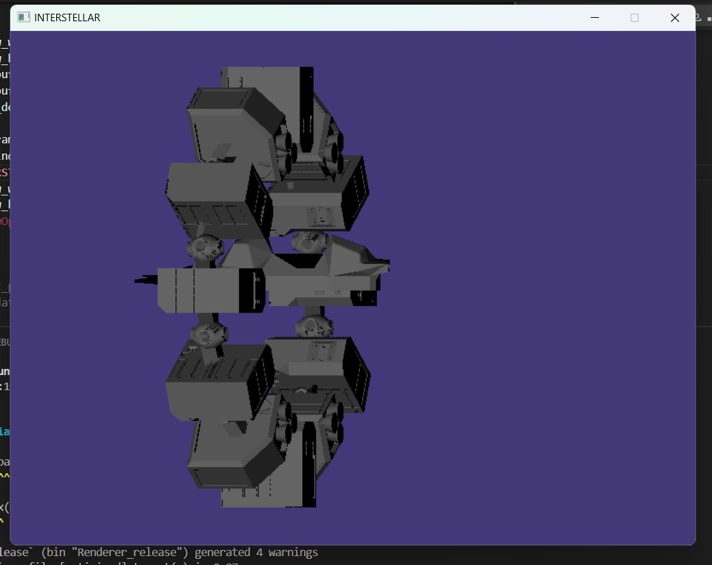

# Rust 3D Graphics Engine

Este proyecto es un motor de gráficos 3D escrito en Rust. Es capaz de cargar y renderizar modelos 3D en formato `.obj`, utilizando transformaciones de rotación, traslación y escala. Los usuarios pueden interactuar con el modelo a través de entradas de teclado para realizar rotaciones y ajustes de zoom. 

### Teclas de Control

- **A / D**: Rotar el modelo a la izquierda/derecha alrededor del eje Y (horizontal).
- **W / S**: Rotar el modelo hacia arriba/abajo alrededor del eje X (vertical).
- **Q / E**: Rotar el modelo a la izquierda/derecha alrededor del eje Z (rotación de inclinación).
- **T / Y**: Hacer zoom in/out en el modelo.
- **Flechas de Dirección**: Mover el modelo en el espacio de la ventana.
- **Escape**: Cerrar la aplicación.

### Descripción del Proyecto

El motor utiliza la librería `minifb` para manejar la ventana y el buffer gráfico, y `nalgebra_glm` para los cálculos de matrices y vectores. Los modelos en formato `.obj` se cargan a través de un módulo que procesa sus vértices y los transforma de acuerdo a las entradas de usuario.

Las transformaciones del modelo incluyen:
- **Rotación**: Alrededor de los ejes X, Y y Z.
- **Escalado**: Control de zoom para acercar o alejar el modelo.
- **Traslación**: Movimiento del modelo en el espacio de la ventana.

### Ejecución

Para ejecutar este proyecto en modo de lanzamiento, sigue estos pasos:

1. Asegúrate de tener Rust instalado.
2. Coloca el archivo `.obj` en la carpeta `src/assets/` con el nombre `spaceship.obj`.
3. Corre el siguiente comando para compilar y ejecutar el proyecto:
```cargo run --release```


### Dependencias

- `nalgebra_glm`: Para cálculos de matrices y vectores.
- `minifb`: Para la gestión de ventanas y gráficos.
- Otros módulos internos para manejar el framebuffer, shader, y procesamiento de vértices.

### Imagen




